```{r setup, include=FALSE}
options(htmltools.dir.version = FALSE)
library(ggplot2)
library(cowplot)
```

# What is GGPLOT?

.pull-left[

GG stands for **"Grammar of Graphics"**

Defines a step-by-step method for building a graph.

### Installation and usage:

```
install.packages("ggplot2")
library(ggplot2)
```

]

.pull-right[

### Based on:
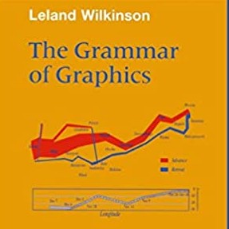
]

---

# The grammar of graphics

.pull-left[
### Steps of building a graph with ggplot

- Start by defining data, x and y variables, colour/fill etc.
- Mention plot type
- Mention statistics to be shown
- Mention slide title, x and y axis titles
- Mention theme

*The first two points are mandatory for a plot, rest are optional.*

*There are many more commands and options, will come to them later.*
]

.pull-right[

```{r eval=FALSE, tidy=FALSE}
ggplot(data = data,
    aes(x = xvar, 
        y = yvar, 
        colour=group)) +
  
  geom_point() +
  
  geom_errorbar() +
  
  labs(
    title = "Main title",
    x = "X axis title",
    y = "Y axis title") + 
  
  theme_default()
```
]

---

# The data we are going to work with

Data on penguins at Palmer Station, Antarctica LTER.

```{r}
library(palmerpenguins)
data(package = "palmerpenguins")
data(penguins)

library(knitr)
kable(head(penguins,5), format="html")
```

---

# A simple example

.pull-left[
```{r eval=FALSE, tidy=FALSE}
ggplot(data=penguins,
       aes(x=bill_length_mm, 
        y=bill_depth_mm, 
        colour=species))+
  
  geom_point()+
      
  labs(
    title = "Penguins at Palmer Station",
    x = "Bill length (mm)",
    y = "Bill depth (mm)") + 
  
  theme_bw()
```
]

.pull-right[
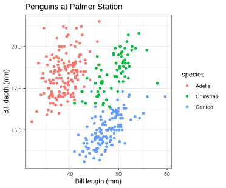
]

---

# ggplot themes

```{r include=FALSE}
library(cowplot)

plt <- ggplot(data=penguins,
       aes(x=bill_length_mm, 
        y=bill_depth_mm, 
        colour=species))+
      geom_point()

p1 <- plt + theme_gray() + labs(title = "theme_gray (Default)") +
  theme(legend.position = "none")
p2 <- plt + theme_bw() + labs(title = "theme_bw") +
  theme(legend.position = "none")
p3 <- plt + theme_classic() + labs(title = "theme_classic") +
  theme(legend.position = "none")
p4 <- plt + theme_dark() + labs(title = "theme_dark") +
  theme(legend.position = "none")
p5 <- plt + theme_linedraw() + labs(title = "theme_linedraw") +
  theme(legend.position = "none")
p6 <- plt + theme_light() + labs(title = "theme_light") +
  theme(legend.position = "none")
p7 <- plt + theme_minimal() + labs(title = "theme_minimal") +
  theme(legend.position = "none")
p8 <- plt + theme_test() + labs(title = "theme_test") +
  theme(legend.position = "none")

plot_grid(p1, p2, p3, p4, p5, p6,p7, p8, ncol=4)
```

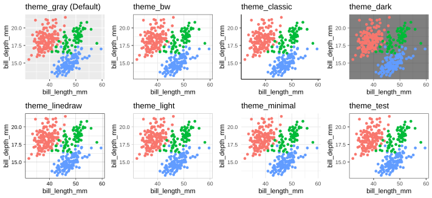

---

# A better theme for publication

The following theme comes from the package "cowplot" (Claus O. Wilke’s plot package) [(Link)](https://wilkelab.org/cowplot/index.html)

.pull-left[
```{r eval=FALSE, tidy=FALSE}

library(ggplot)
library(cowplot)

ggplot(data=penguins,
       aes(x=bill_length_mm, 
        y=bill_depth_mm, 
        colour=species))+
  
  geom_point()+
      
  labs(
    title = "Penguins at Palmer Station",
    x = "Bill length (mm)",
    y = "Bill depth (mm)") + 
  
  theme_cowplot()
```
]

.pull-right[
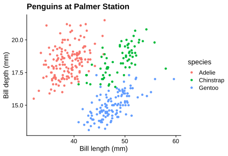]

This theme comes with classic look for the plot, along with better text spacing, larger text and bold title.

---

# Customizing plot - changing axis limits

If you go back and look at the plot in the previous slide, the axis ticks are not complete.

We can easily solve that by adding `expand_limits` command.

```{r include=FALSE}
plt <- ggplot(data=penguins,
              aes(x=bill_length_mm, 
                y=bill_depth_mm, 
                colour=species))+
  
        geom_point()+
      
        labs(
          title = "Penguins at Palmer Station",
          x = "Bill length (mm)",
          y = "Bill depth (mm)") + 
  
        theme_cowplot()
```


.pull-left[
```{r eval=FALSE}
plt + 
  expand_limits(x = c(30,60), y=c(12,22))
```

*The rest of the code is same as previous, so has been put inside ```plt```*
]

.pull-right[
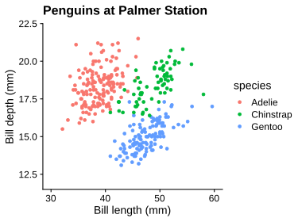
]

---

# Customizing plot - changing axis scaling

In all the previous plots, the x and y axes were not in the same scale. If you require the axes to be in the same scale, that is easily doable.

We just have to add `coord_equal()` command.


```{r eval=FALSE}
plt + 
  expand_limits(x = c(30,60), y=c(12,22)) +
  coord_equal()
```


---

# Customizing plot - changing text style

You can do many things using the `theme()`  command, e.g. changing style, colour and angle of the texts.

*Remember - this `theme()` command has to be used in addition to the `theme_cowplot()` (or other theme commands) that we are using.*

.pull-left[

```{r eval=FALSE}
plt + theme(
  axis.title.x = element_text(face="bold"),
  axis.title.y = element_text(face="bold"),
  axis.text.x = element_text(angle=45),
  axis.text.y = element_text(angle=45),
  plot.title = element_text(face="bold", 
                            color="blue"),
  legend.title = element_text(face="bold", 
                              color="red")
  )
```

]

.pull-right[

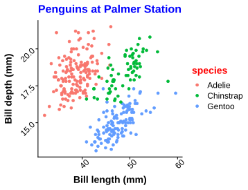

]

---

# Plot types - Box and Whisker plot

We have been using only scatterplots till now, using the command `geom_point()`.

To make a box-and-whisker plot, or boxplot in short, use the command `geom_boxplot`.

.pull-left[
```{r eval=FALSE}
ggplot(data=penguins,
      aes(x=species, 
          y=body_mass_g, 
          fill=species))+
  
      geom_boxplot()+
      
      labs(
        title = "Box-and-Whisker plot",
        x = "Species",
        y = "Body mass (g)") + 
  
      theme_cowplot() + 
  
      theme(legend.position = "none")
```
]

.pull-right[
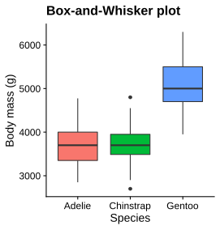
]

---

# Plot types - Box and Whisker plot with jittered points

One plot style which is becoming quite common is boxplots with jittered points overlayed on top, for better visualization of the data.

.pull-left[
```{r eval=FALSE}
ggplot(data=penguins,
      aes(x=species, 
          y=body_mass_g, 
          fill=species))+
  
      geom_boxplot(outlier.shape=NA,
                   show.legend=FALSE)+ 
      geom_jitter(aes(fill=species),
                  colour="black",
                  shape=21,
                  width=0.2,
                  show.legend=FALSE)+
      labs(
        title = "Boxplot + jittered points",
        x = "Species",
        y = "Body mass (g)") + 
  
      theme_cowplot()
```
]

.pull-right[
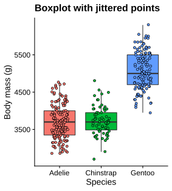
]

---

# Alternatives to boxplot - Jitter plot

In the previous slide, we plotted boxplots along with jittered points.

But jittered points alone can also be a very useful plot for describing your data.

.pull-left[
```{r eval=FALSE}
ggplot(data=penguins,
      aes(x=species, 
          y=body_mass_g, 
          colour=species))+
  
      geom_jitter(width=0.2, alpha=0.5,
                  show.legend=FALSE)+
      labs(
        title = "jittered points",
        x = "Species",
        y = "Body mass (g)") + 
  
      theme_cowplot()
```
]

.pull-right[
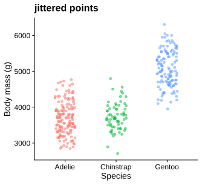
]

---

# Alternatives to boxplot - boxplot + violin plot

Another good alternative, which is being increasingly used nowadays, is combining boxplot with violin plot.

It shows where you have most data points using kernel density.

.pull-left[
```{r eval=FALSE}
ggplot(data=penguins,
      aes(x=species, 
          y=body_mass_g, 
          fill=species))+
  
      geom_violin(show.legend=FALSE,
                  colour="transparent")+
      geom_boxplot(show.legend=FALSE,
                   width=0.2,
                   fill="white")+
  
      labs(
        title = "Boxplot + Violin plot",
        x = "Species",
        y = "Body mass (g)") + 
  
      theme_cowplot()
```
]

.pull-right[
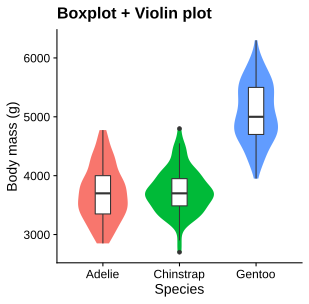
]


---

# Column charts (mean-SD) - prepare data

Column charts which show mean and SD values are one of the most popular plots to be displayed in research articles, but making them in R is a little complicated.

We need to first calculate the mean and SD of body mass for the three penguin species. We will do this with the help of the package `dplyr`. (click [link](https://rpubs.com/justmarkham/dplyr-tutorial) for a tutorial of `dplyr`)

*We first divide the data into three species using `group_by` command, and then calculate the mean and SD using `summarise` command.*

*The `%>%` is called **pipe**, and used to pass output of one command to the next.*

.pull-left[
```{r message=FALSE}
library(dplyr)

penguins2<-na.omit(penguins)
pngSum <- penguins2 %>%
  group_by(species) %>%
  summarise(mean=mean(body_mass_g),
            sd=sd(body_mass_g))
```
]

.pull-right[

```{r echo=FALSE}
kable(pngSum, format = "html")
```

]

---

# Column charts (mean-SD) - Create plot

Mean values are used to create the columns with `geom_col` command, and SD values are used to create the error bars with `geom_errorbar` command.

.pull-left[
```{r eval=FALSE}
ggplot(pngSum, 
       aes(species, mean,
           fill=species))+
  
  geom_col(show.legend=F)+
  geom_errorbar(
    aes(ymin=mean-sd, 
        ymax=mean+sd),
    width=0.3)+
  
  labs(x="Species",
    y="Body Mass (g)",
    title="Penguin body mass")+
  
  theme_cowplot()
```

]

.pull-right[
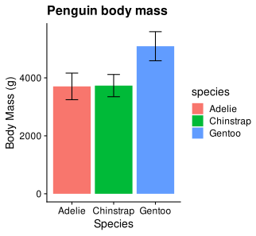
]

---

# Side-by-side Column charts - prepare data

Side-by-side column charts are a great way to visualize more than two categorical variables in the same plot. 

The data preparation is the same as before, but in this case we calculate the mean and SD values for two grouping variables instead of one.

.pull-left[
```{r message=FALSE}
library(dplyr)
penguins2<-na.omit(penguins)
pngSum2 <- penguins2 %>%
  group_by(species,sex) %>%
  summarise(mean=mean(body_mass_g),
            sd=sd(body_mass_g))
```

]

.pull-right[
```{r echo=FALSE}
kable(pngSum2, format = "html")
```

]

---

# Side-by-side Column charts - Create plot

The commands for plotting is similar to the normal column chart. You only need to add `position="dodge"` in the `geom_col()` command. 

As we are also showing errorbars in this plot, the same command has to be used in `geom_errorbar()`. To position the errobars at the centre of the columns, instead of using `position="dodge"`, the function `position_dodge()` is being used here with an appropriate position.

.pull-left[
```{r}
ggplot(pngSum2, 
       aes(species, mean,
           fill=sex))+
  geom_col(position='dodge')+
  geom_errorbar(
    aes(ymin=mean-sd, 
        ymax=mean+sd),
    width=0.3,
    position=position_dodge(0.9))+
  labs(x="Species",
       y="Body Mass (g)",
       title="Penguin body mass")+
  theme_cowplot()
```

]

.pull-right[
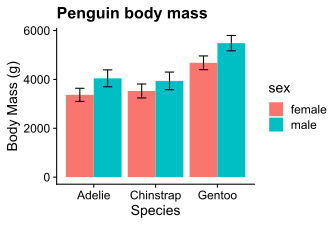
]

---

# Bar charts

Bar charts (a.k.a horizontal bar charts) are considered by some to be superior to column charts. Bar charts are said to be easier in the eyes, as well as it is easier to make comparisons among the horizontal bars than vertical columns in a plot.

Making a bar chart is very easy - you just to need add the command `coord_flip()` in the plot, which flips the X and Y axes. We are using the same plot as before, so the rest of the commands have been omitted.

.pull-left[
```{r eval=FALSE}
plot + 
  coord_flip()
```

]

.pull-right[
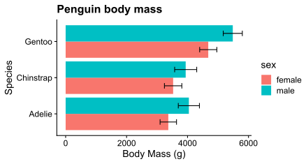
]

---

# Pie charts - prepare data

Making pie charts in R is a little complicated, and the same holds true for ggplot. 

First, we need to prepare the data. Here we are going to visualize the sample size of each species in a pie chart.

.pull-left[
```{r}
# Count the numbers
ad<-length(which(penguins$species=="Adelie"))
gt<-length(which(penguins$species=="Gentoo"))
cs<-length(which
           (penguins$species=="Chinstrap"))

# Create a dataframe of counts
count<-c(ad, gt, cs)
species<-c("Adelie","Gentoo","Chinstrap")
percent<-round((count/sum(count))*100, 2)
peng_count<-data.frame(
              count, species, percent, 
              stringsAsFactors=TRUE)
```
]

.pull-right[
The data for pie chart looks like the table below. The percentages were calculated to use as labels for the slices in the chart.

```{r echo=FALSE}
kable(peng_count, format="html") 
```

]

---

# Pie charts - Create pie chart

.pull-left[
```{r eval=FALSE}
ggplot(peng_count,aes(x="",y=count, 
                  fill=species))+ 
  
  geom_bar(width=1,stat="identity")+
  coord_polar("y", start=0)+
  
  theme_cowplot()+
  theme(
    axis.line=element_blank(),
    axis.title.x = element_blank(),
    axis.title.y = element_blank(),
    axis.text.x = element_blank(),
    axis.text.y = element_blank(),
    axis.ticks = element_blank()
  )+
  
  geom_text(aes(
    label=paste0(percent,"%")), 
    position=position_stack(vjust=0.5))
```

]

.pull-right[
The trick to creating pie-chart is to first create a bar plot, and convert its coordinates to polar. 

The axes have been removed completely for aesthetics, and the percentages have been added as slice labels in the plot.


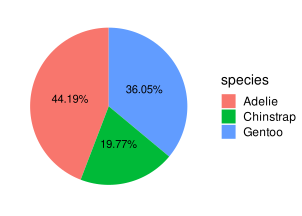
]

---

# Scatter plot

Making a scatter plot is very easy using the `geom_point` command.

.pull-left[
```{r eval=FALSE}
ggplot(data=penguins,
       aes(x=body_mass_g,
           y=flipper_length_mm,
           colour=species))+
  
  geom_point()+
  
  labs(x="Body mass (g)",
       y="Flipper length (mm)")+
  
  theme_cowplot()
```

]

.pull-right[
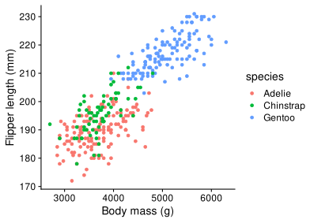
]

---

# Adding regression line to a scatter plot

.pull-left[
```{r eval=FALSE}
reg<-lm(
  flipper_length_mm ~ body_mass_g,
  data=penguins)

ggplot(data=penguins,
    aes(x=body_mass_g,
        y=flipper_length_mm,
        colour=species))+
  
  geom_abline(
   intercept=coefficients(reg)[1], 
   slope=coefficients(reg)[2],
   color="grey", size = 1.5)+
  
  geom_point()+
  
  labs(x="Body mass (g)",
       y="Flipper length (mm)")+
  
  theme_cowplot()
```

]

.pull-right[
*In this case, a linear regression was performed using `lm()` command, and the coefficients were used to draw a regression line using `geom_abline()` command.*

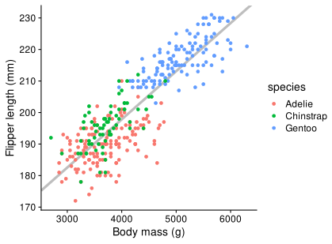
]

---

# Adding regression line - alternate method

Instead of performing regression manually and using the coefficients to draw a line, you can use `stat_smooth` command to do it automatically.

*The default in `stat_smooth` is LOESS ([link](http://r-statistics.co/Loess-Regression-With-R.html)) or GAM ([link](http://environmentalcomputing.net/intro-to-gams/)) smoothing, but a linear fit can easily be drawn using `method="lm"`. The grey area around the line is 95% confidence interval, and can be turned off using `se=FALSE`.*

.pull-left[
```{r eval=FALSE}
ggplot(data=penguins,
       aes(x=body_mass_g,
           y=flipper_length_mm,
           colour=species))+
  
  geom_point()+
  
  stat_smooth(method="lm", 
      col="#717171", size=1.2)+
  
  labs(x="Body mass (g)",
       y="Flipper length (mm)")+
  
  theme_cowplot()
```

]

.pull-right[
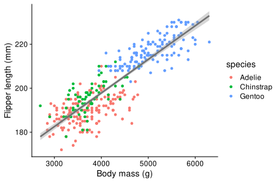
]

---

# Adding horizontal and vertical lines

Adding lines to show the mean (or other values) of the X and Y variable can be done using `geom_vline` and `geom_hline` commands.

.pull-left[
```{r eval=FALSE}
ggplot(data=na.omit(penguins),
       aes(x=body_mass_g,
           y=flipper_length_mm,
           colour=species))+
  
  geom_vline(
    aes(xintercept=mean(body_mass_g)),
    size=1.2, color="grey")+
  
  geom_hline(
    aes(yintercept=mean(flipper_length_mm)),
    size=1.2, color="grey")+
  
  geom_point()+
  
  labs(x="Body mass (g)",
       y="Flipper length (mm)")+
  
  theme_cowplot()
```

]

.pull-right[

]

---

# Histograms

Histograms can be created easily by `geom_histogram` command. The command automatically uses an optimal number of bins, but the number can be changed using `binwidth` argument.

*To ensure visibility of histograms for all groups, you can make them semi-transparent using `alpha` and `position="identity"` arguments.*

.pull-left[
```{r eval=FALSE}
ggplot(data=penguins,
       aes(x=body_mass_g,
           fill=species,
           colour=species))+
  
  geom_histogram(alpha=0.5,
        position="identity")+
  
    labs(x="Body mass (g)",
       y="Frequency")+
  
  theme_cowplot()
```

]

.pull-right[

]

---

# Density plots

Density plots represent data in a way similar to histograms, but instead of actual frequencies of x-axis values, it uses estimates of the probability density function of the variable in the x-axis ([link](https://www.data-to-viz.com/graph/density.html)).

.pull-left[
```{r eval=FALSE}
ggplot(data=penguins,
       aes(x=body_mass_g,
           fill=species,
           colour=species))+
  
  geom_density(alpha=0.5,
        position="identity")+
  
    labs(x="Body mass (g)",
       y="Density")+
  
  theme_cowplot()
```

]

.pull-right[
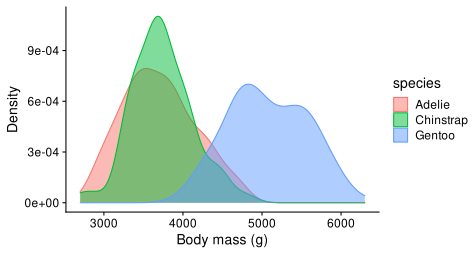]

---

# Ridge plots

Ridge plots are becoming very popular to visualize the distribution of a variable across several groups ([link](https://www.data-to-viz.com/graph/ridgeline.html)). The `ggridges` package provides an add-on to ggplot for creating ridge plots.

.pull-left[
```{r eval=FALSE}
library(ggridges)

ggplot(data=penguins,
       aes(x=flipper_length_mm,
           y=factor(year),
           fill=species))+
  
  geom_density_ridges(
    alpha=0.5, scale=0.9,
    colour="white")+
  
  labs(x="Flipper length (mm)",
       y="Year")+
  
  theme_cowplot()
```

]

.pull-right[
*Year has been converted to a factor to create year categories. The `scale` argument prevents overlap of plot between years.*

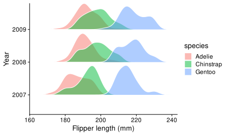
]

---

# Line plots - prepare data

The data in the previous slide can also be visualized using a simple line plot. But to plot it we need to prepare the data first, i.e. calculate mean flipper lengths across species and years.

.pull-left[
```{r message=FALSE}
lp <- subset(penguins, 
  select=c(species,flipper_length_mm,year))
lp <- na.omit(lp)
lp$year <- as.factor(lp$year)

lp2 <- lp %>% 
  group_by(species, year) %>% 
  summarise(mean=mean(flipper_length_mm))
```

We selected the required variables from penguins and put them into `lp`. Then we calculated mean values and put them into `lp2`.
]

.pull-right[
```{r echo=FALSE}
kable(lp2, format = "html")
```
]

---

# Line plot - create plot

For creating a line plot, we will use `geom_line` for the lines and `geom_point` for the points. 

*You can also use `geom_pointrange` instead of `geom_point` if you want errorbars - just make sure to calculate SD/SE beforehand.*

.pull-left[
```{r eval=FALSE}
ggplot(data=lp2,
       aes(x=year,
           y=mean,
           group=species,
           colour=species))+
  
  geom_line(size=1.2)+
  geom_point(size=3)+
  
  labs(y="Flipper length (mm)",
       x="Year")+
  
  theme_cowplot()
```

]

.pull-right[
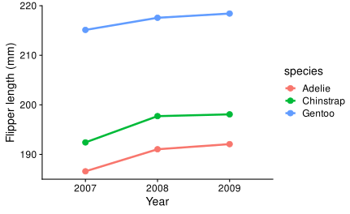
]
---

# Facets - using single grouping variable

Facets are a useful way to divide plot according to grouping variables.

Here are we are looking at the difference in body mass between males and females, and creating facets of species with the command `facet_wrap`.

.pull-left[
```{r eval=FALSE}
ggplot(data=na.omit(penguins),
       aes(x=sex,
           y=body_mass_g,
           fill=sex))+
  
  geom_boxplot(width=0.5)+
  
  labs(x="Sex",
       y="Body Mass (g)")+
  
  facet_wrap(~ species, nrow=1)+
  
  theme_cowplot()+
  theme(legend.position = "n")
```

]

.pull-right[
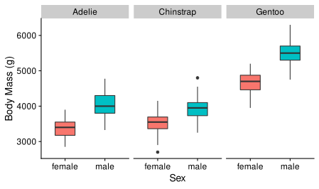]

---

# Facets - using two grouping variables

Facets can also be created using two grouping variables with `facet_grid` command.

In this case we add one more variable - `island`, in the plot of the previous slide.

.pull-left[
```{r eval=FALSE}
ggplot(data=na.omit(penguins),
       aes(x=sex,
           y=body_mass_g,
           fill=sex))+
  
  geom_boxplot(width=0.5)+
  
  labs(x="Sex",
       y="Body Mass (g)")+
  
  facet_grid(island ~ species)+
  
  theme_cowplot()+
  theme(legend.position = "n")
```

]

.pull-right[
]

---

# Plot grid

Facets are useful when you are creating multiple plots of the same plot type and with the same data, but does not work when you want to combine multiple plots.

.pull-left[
```{r eval=FALSE, message=F}
p1 <- ggplot(
    data=penguins,
    aes(x=species,y=body_mass_g,
        fill=species))+
    geom_boxplot(width=0.5)+
    theme_cowplot()+
    theme(legend.position = "n")

p2 <- ggplot(
    data=penguins,
    aes(x=body_mass_g,y=bill_length_mm,
      colour=species))+
    geom_point()+
    theme_cowplot()+
    theme(legend.position = "n")

plot_grid(p1,p2,nrow=1,
          labels=c("A","B"))
```

]

.pull-right[
*`plot_grid` command from `cowplot` package is extremely useful when you are creating a multi-panel plot for publication.*

<br>

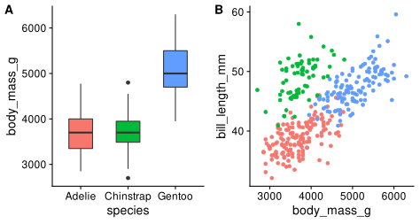]

---

# Custom colours 1 - colour brewer

ggplot has a lot of options for changing the colour scheme of plots. One of them is `scale_colour_brewer`, useful for using in categorical variables.

*Palette `Dark2` is being used here. For other available palettes, take a look at the help file.*

.pull-left[
```{r eval=FALSE, message=F}
ggplot(
  data=penguins,
  aes(x=body_mass_g,y=bill_length_mm,
      colour=species))+
  
  geom_point()+
  
  theme_cowplot()+
  
  labs(x="Body mass (g)",
         y="Bill length (mm)",
         title="Palette Dark2")+

  scale_colour_brewer(palette="Dark2")
```

]

.pull-right[
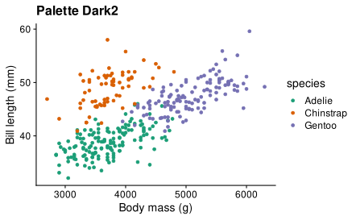]

---

# Custom colours 2 - continuous colours

For colouring continuous variables, `scale_colour_gradient` can be used.

*the command has its own default colours, but for demonstration we are using a custom colour palette here.*

.pull-left[
```{r eval=FALSE, message=F}
ggplot(
  data=penguins,
  aes(x=body_mass_g,y=bill_length_mm,
      colour=body_mass_g))+
  
  geom_point()+
  theme_cowplot()+
  
  labs(x="Body mass (g)",
       y="Bill length (mm)",
       title="scale_colour_gradient")+

  scale_colour_gradient(
    high="red",low="blue",
    "Body mass")
```

]

.pull-right[
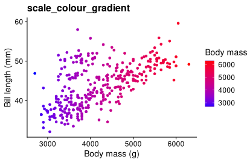]

---

# Custom colours 3 - Viridis palette

Viridis is a very popular colour palette, suitable for people with colour-blindness and for printing in grayscale.

*Viridis is useful for both continuous and categorical variables.*

.pull-left[
```{r eval=FALSE, message=F}
library(viridis)

ggplot(
  data=penguins,
  aes(x=body_mass_g,y=bill_length_mm,
      colour=body_mass_g))+
  
  geom_point()+
  theme_cowplot()+
  
  labs(x="Body mass (g)",
       y="Bill length (mm)",
       title="Viridis palette")+

  scale_colour_viridis("Body mass")
```

]

.pull-right[
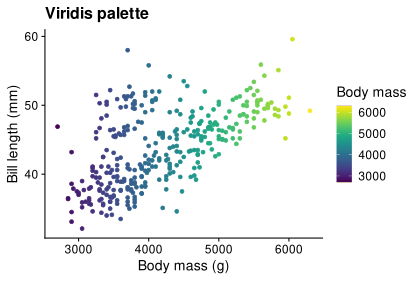]

---

# Try it out yourself

.pull-left[
What I have shown here is just the tip of the iceberg. 

ggplot is an amazing visualization package, and there are lot more plot types, options and customization available.
]

.pull-right[
Try it our yourself to see the possibilities.

Hope this tutorial was helpful.

Bye!
]

<br><br>
### Credits:
This tutorial was inspired by this amazing blog post: [link](https://cedricscherer.netlify.app/2019/08/05/a-ggplot2-tutorial-for-beautiful-plotting-in-r/)

The presentation was made using [xaringan](https://github.com/yihui/xaringan) R package.